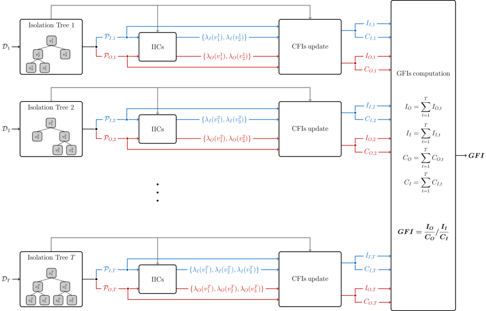

# Interpretable Anomaly Detection with DIFFI: Depth-based Isolation Forest Feature Importance
Code for the paper "[Interpretable Anomaly Detection with DIFFI: Depth-based Isolation Forest Feature Importance](https://arxiv.org/abs/2007.11117)". 



### Citation
If you use this code, please cite our paper as follows:

```
@article{carletti2020interpretable,
  title={Interpretable anomaly detection with diffi: Depth-based feature importance for the isolation forest},
  author={Carletti, Mattia and Terzi, Matteo and Susto, Gian Antonio},
  journal={arXiv preprint arXiv:2007.11117},
  year={2020}
}
```
